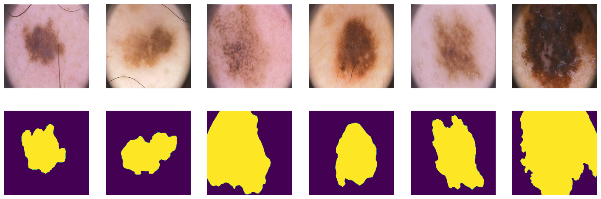

# Capstone 1

With any questions you can write to me in telegram @difurka

The project solves the problem of mole segmentation. Since we cannot display pictures in 'gunicorn', 'get_response' sends the score of the area of intersection of the obtained result and the target.

The result of model you can see in Notebook.ipynb:

## Content

- **Data**: load by *wget -c https://www.dropbox.com/s/8lqrloi0mxj2acu/PH2Dataset.rar*
- **Notebook**: contains data preparation,model selection process and parameter tuning
- Script **train.py** (suggested name): training the final model, saving it to a file 
- Script **predict.py** (suggested name): loading the model, serving it via a web service with Flask
- **Pipenv** and **Pipenv.lock**: Files with dependencies
- **Dockerfile**: running the service
- **makefile**: easy start docker and other programs